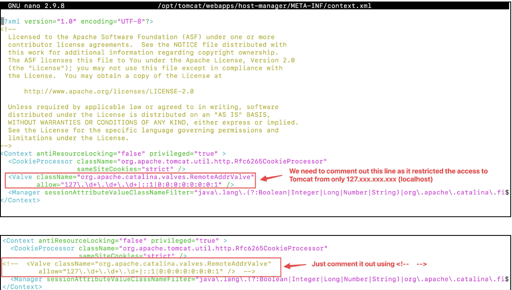

# Week 4 Tutorial
## Challenge 0:
### Fix 403 Error
1. Edit context.xml
```bash 
nano /opt/tomcat/webapps/host-manager/META-INF/context.xml
```


2. Edit the second context.xml
```bash
nano /opt/tomcat/webapps/manager/META-INF/context.xml
```


3. Restart the tomcat
```bash
tomcatdown
tomcatup
```
### Set up Tomcat users
1. Go to the config file for user setup
```bash
nano /opt/tomcat/conf/tomcat-users.xml 
```
2. Add the following roles to that file: \
\<role rolename="admin-gui"/> \
\<role rolename="manager-gui"/> \
\<role rolename="manager-script"/> \
\<role rolename="manager-jmx"/> \
\<role rolename="manager-status"/> \
\<user username="admin" password="s3cret" roles="admin-gui,manager-gui, manager-script, manager-jmx, manager-status"/>

## Challenge 1: Modify the Web Application to Display Dynamic Content