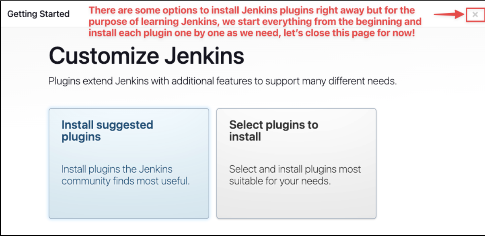
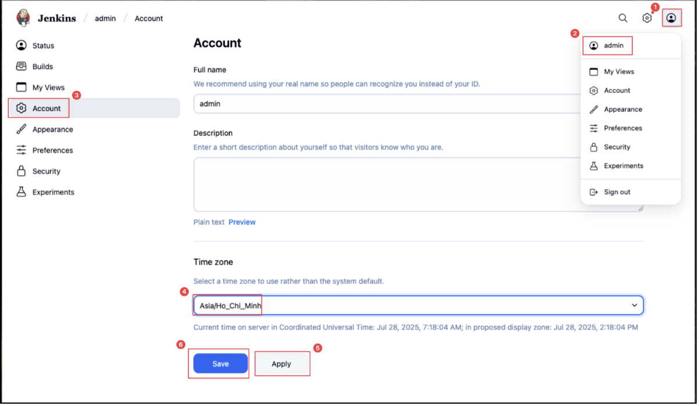

# Jenkins Cheat Sheet
## Set up Jenkins
1. Run the automatic script for Jenkins setting
2. Enter the password cat from configuration file
3. For "Customize Jenkins" page:
   
4. Log in with "admin" and copied password
5. Change the timezone:
   

## Create job on Jenkins
### Basic Hello World
1. Click Jenkins logo
2. Click "New Item"
3. Add Description
4. Add Build Steps => Execute shell
5. Add bash script
```bash
echo "Hello World from DevOps class of RMIT!"
uptime
```
6. Click "Apply"
7. Click "Save"
8. Finally, click "Build Now"

### Integrate with GitHub
#### On EC2 instance
```bash
yum install git
```
#### On Jenkins server
1. Add plugin - GitHub
2. Go to "Tools" => Git Installation => Input Git/git
3. Create new job on GitHub
4. Configure GitHub on Jenkins
5. Go to "Source Code Management" => Add Git: 
- https link
- credentials: None
- branch: main

### Integrate with Maven
#### On EC2 instance of Jenkins