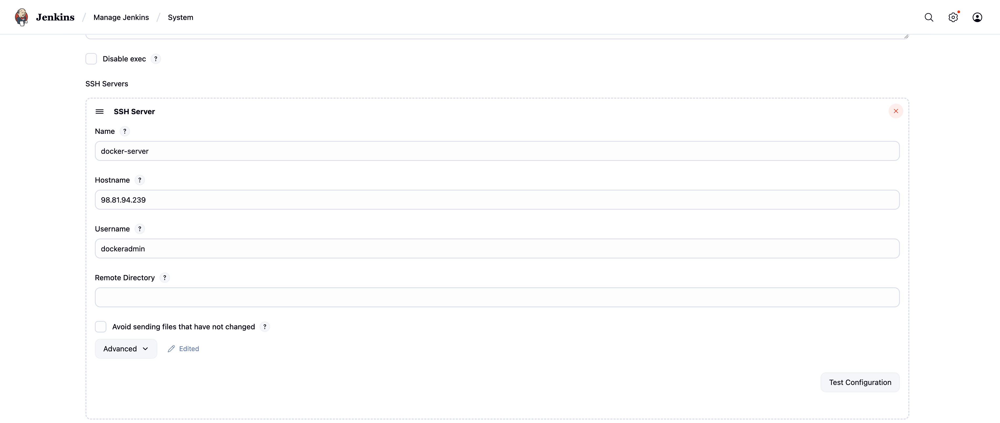
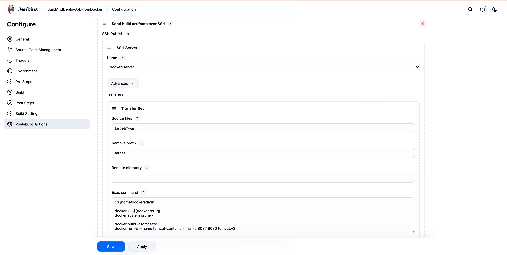

# Docker Tutorials

## Docker Command Lines
1. View current available images
```bash
docker images
```
2. View current running containers
```bash
docker ps
```
ps stands for process status
3. Run an image (the container will be removed intermediately after running)
```bash
docker run <image_name> 
```
4. List all containers despite their statuses
```bash
docker ps -a 
```
5. Remove a container
```bash
docker rm <container_id> #View by docker ps
```
5. Remove an image
```bash
docker rmi <image_id> #View by docker images
```
6. Pull an image
```bash
docker pull <image_name> 
```
7. Run a container with port and image, container name
```bash
docker run -d --name <container_name> --p <outside_port>:<inside-port> <image-name>
```
8. Stop a container
```bash
docker stop <container_name>
```
9. Start a container
```bash
docker start <container_name> 
```
10. Build an image from Dockerfle
```bash
docker build -t <image-name> <Dockerfile-location> 
```

## Integrate with Jenkins 
**Prequitesite**: Add user dockeradmin
0. Add a Dockerfile to /home/dockeradmin
1. Plugins: Publish over SSH
2. System: Add server

3. Job Configure - Add server and execute shell
```bash
cd /home/dockeradmin

docker kill $(docker ps -q)
docker system prune -f

docker build -t tomcat:v2 .
docker run -d --name tomcat-container-final -p 8087:8080 tomcat:v2 
```
